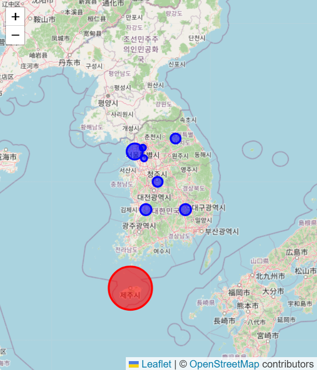
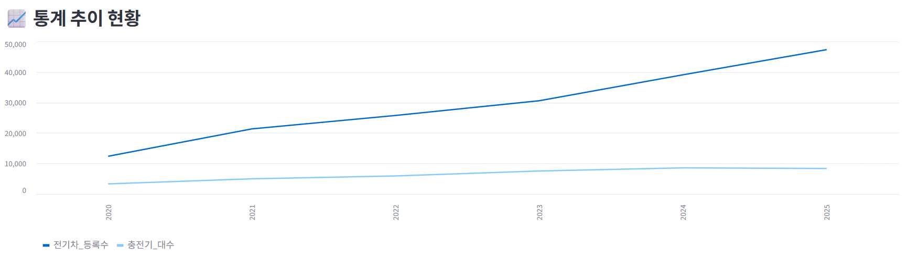

# 🔌 전기차 충전 인프라 SOS 대시보드

> 전기차 등록 현황과 지역별 충전기 수를 분석해 **충전 불편지수**를 산출하고,
> 지자체 행정 담당자에게 인프라 격차를 시각적으로 알리는 정책 지원 시스템입니다.

<br>

## 📌 프로젝트 한눈에 보기

- **프로젝트명**: 전기차 등록 현황과 지역별 충전기 수에 따른 불편지수 시각화 및 FAQ
- **진행 기간**: 2026.04.15 ~ 2026.04.16 (2일간)
- **팀명**: f(x) electric shock
- **핵심 목표**
  - 연도별 / 지역별 전기차 등록 현황 및 충전기 수 시각화
  - 충전 불편지수 산출 및 지도 기반 SOS 핫스팟 표현
  - 민원 기반 FAQ로 기업 · 지자체의 문제 해결 방향 제시
- [체험 링크 (~04/17까지)](https://electric-shock.streamlit.app/)
---

## 📎 발표 자료

- [발표자료 보기](./docs/SKN30_1st_4Team_발표자료.pptx)

---

## 👥 팀 소개


| 이름 | 역할 | 담당 업무 |
|:---|:---|:---|
| 김도훈 | 데이터 엔지니어 | 데이터 수집, 데이터 정제 |
| 정주애 | 데이터 엔지니어 · 프론트 | 데이터 수집, 데이터 정제, Streamlit |
| 이동욱 | 데이터 분석가 | ERD 설계, 데이터 분석 |
| 홍철민 | 백엔드 · 프론트 | ERD 설계, 쿼리 작성, 데이터 적재, Streamlit |
| 김효선 | 콘텐츠 · 분석 | 크롤링, 워드 클라우드 |

---

## 📖 프로젝트 개요

### 1) 프로젝트 주제
**전기차 등록 현황과 지역별 충전기 수에 따른 불편지수 시각화 및 FAQ**

### 2) 프로젝트 배경

탄소중립 정책 기조 아래 전기차 보급은 급격히 증가하고 있지만, 충전 인프라는 이를 따라가지 못하고 있습니다.

- 정부 2030년 충전기 보급 목표 **123만 대** — 현재 속도로는 달성 불가 ([정책브리핑](https://www.korea.kr/news/policyNewsView.do?newsId=148917043))
- 충전 인프라가 **서울 · 경기에 집중**되어 지방 소외 심화
- 인프라 부족은 실사용자 불편을 넘어 **국가 환경 목표 달성 자체를 위협**

본 프로젝트는 이 수치적 불균형을 데이터로 증명하고,
지자체 행정 담당자에게 정책적 경각심을 부여하여 **예산 편성 우선순위 결정을 돕는 것**을 목표로 합니다.

---

## 🎯 프로젝트 목표

### 주요 목표
1. **연도별 · 지역별 시각화**
   전기차 등록 현황과 충전기 수 변화 추이를 비교 차트로 제공

2. **충전 불편지수 산출 및 지도 표현**
   `2 * (EV / Charger) + 1 * (Area / Charger) ** 0.5` 공식으로 지수 산출 후
   17개 시도별 불편지수를 SOS 핫스팟 히트맵으로 지도에 시각화

3. **민원 중심 FAQ**
   충전 관련 민원 위주 FAQ 구성으로 기업 · 지자체 문제 해결 방향 제시

### 학습 목표
- 공공데이터 수집 및 전처리 (CSV / API)
- MySQL 기반 데이터베이스 설계 및 적재
- Streamlit 기반 데이터 시각화 서비스 구현

---

## 🧩 주요 담당 업무 (R&R)

| 역할 | 담당자 | 담당 업무 | 사용 데이터 | 주요 산출물 |
|:---|:---|:---|:---|:---|
| 데이터 수집 · 정제 | 김도훈 | 공공데이터 수집, CSV 정제 | 한국전력공사 전기차·충전기 현황 CSV | 정제 데이터셋 |
| 데이터 수집 · Streamlit | 정주애 | 데이터 수집, 정제, UI 구현 | 공공데이터 CSV | 정제 데이터, Streamlit 화면 |
| ERD · 분석 | 이동욱 | DB 스키마 설계, 데이터 분석 | 정제 데이터 | ERD, 분석 결과 |
| 백엔드 · Streamlit | 홍철민 | 쿼리 작성, 데이터 적재, UI 설계 | MySQL, 정제 데이터 | SQL, 대시보드 설계 |
| FAQ · 워드 클라우드 | 김효선 | 민원 FAQ 구성, 키워드 시각화 | 민원 데이터, 크롤링 결과 | FAQ 데이터셋, 워드 클라우드 |

---

## 🗂 프로젝트 구조

```bash
SKN30-1st-4Team/
├── .env                              # API 키, DB 비밀번호 등 환경변수 (Git 제외)
├── .env.sample                       # .env 작성 예시 템플릿
├── .gitignore
├── README.md
├── main.py                           # Streamlit 메인 실행 파일
├── pyproject.toml                    # 의존성 관리 (uv)
│
├── config/
│   ├── config.py                     # 환경 변수 로드 및 전역 설정
│   └── db_manager.py                 # MySQL 연결 및 쿼리 실행 매니저
│
├── domain/
│   ├── ev_service.py                 # 데이터 로드 / 전처리 / 분석 핵심 로직
│   ├── ev_schema.py                  # Pandera 데이터 규격 정의
│   ├── load_by_csv.py                # CSV 기반 데이터 로드 및 불편지수 산출
│   ├── load_by_db.py                 # DB 기반 데이터 파이프라인
│   ├── ev_charger_api.py             # 공공데이터 충전기 API 클라이언트
│   ├── data_gov_client.py            # 공공데이터포털 API 공통 클라이언트
│   ├── ev_csv_file_made.py           # CSV 병합 및 가공 스크립트
│   ├── ev_charger_slow_fast_sum.py   # 완속/급속 충전기 합산 처리
│   │
│   ├── crawling/
│   │   ├── ev_or_kr.py               # ev.or.kr 크롤링 스크립트
│   │   ├── word_cloud.py             # 워드 클라우드 생성
│   │   ├── ev_or_kr_csv/             # 연도별(2018~2026) 크롤링 결과 CSV
│   │   ├── word_cloud/               # 연도별 워드 클라우드 이미지 (JPG)
│   │   └── word_cloud_bg/            # 배경 포함 워드 클라우드 이미지 (PNG)
│   │
│   ├── sql/
│   │   └── 1.CREATE_TABLE.sql        # ev_infrastructure_stats 테이블 DDL
│   │
│   ├── src_raw/                      # 수집 원본 데이터
│   │   ├── 한국전력공사_지역별 전기차 현황정보/
│   │   ├── 충전기/
│   │   └── 충전소/
│   │
│   └── src_clean/                    # 정제 완료 데이터
│       ├── 전기차_등록_현황_광역_통합.csv
│       ├── 전기차_등록_현황_연도별_변환.csv
│       ├── 전기차_충전기_합계_연도별_변환.csv
│       └── 한국전력공사_지역별 현황정보/
│
├── web/
│   ├── view.py                       # UI 메인 레이아웃 및 탭 제어
│   ├── section_map.py                # 지도 시각화 (SOS 핫스팟)
│   ├── section_line_chart.py         # 연도별 추이 라인 차트
│   ├── section_comparison_chart.py   # 수요-공급 비교 바 차트
│   ├── section_data_table.py         # 상세 데이터 표 및 CSV 다운로드
│   └── section_wordcloud.py          # 키워드 워드 클라우드
│
└── docs/
    ├── planning.md                   # 프로젝트 기획서
    ├── requirements.md               # 요구사항 명세서
    └── technical_specification.md    # 기술 명세서
```

---

## 🚀 실행 가이드

```bash
# 1. 저장소 클론
git clone https://github.com/Hong1008/SKN30-1st-4Team.git
cd SKN30-1st-4Team

# 2. 의존성 설치
uv sync

# 3. 대시보드 실행
uv run streamlit run main.py
```

---

## 🛠 기술 스택 및 협업 도구

<p>
  
  
  
  
  <br>
  
  
  
  
</p>

| 구분 | 기술 |
|:---|:---|
| 언어 | Python 3.13 |
| 데이터 처리 | Pandas, NumPy, Pandera |
| 크롤링 | Selenium |
| DB | MySQL |
| 시각화 | Streamlit, Plotly, Folium, WordCloud |
| 패키지 관리 | uv |

---

## 📂 문서

- [프로젝트 기획서](./docs/planning.md)
- [요구사항 명세서](./docs/requirements.md)
- [기술 명세서](./docs/technical_specification.md)
- [발표 자료](./docs/SKN30_1st_4Team_발표자료_파이널.pdf)

---

## 🏞️ ERD

```
┌─────────────────────┐          ┌──────────────────────────────┐
│  year  (연도 메타)   │          │  region  (지역 메타데이터)    │
├─────────────────────┤          ├──────────────────────────────┤
│ 🔑 year  SMALLINT   │          │ 🔑 region_name  VARCHAR(50)  │
└──────────┬──────────┘          │    lat          DOUBLE       │
           │ 1:N                 │    lon          DOUBLE       │
           │                     │    area         DOUBLE       │
     ┌─────┘                     └───────────────┬──────────────┘
     │                                           │ 1:N
     ▼                                           ▼
┌─────────────────────────┐    ┌──────────────────────────────────┐
│  qna  (충전소 질의응답)  │    │  stat_ev  (지역별 통계)           │
├─────────────────────────┤    ├──────────────────────────────────┤
│ 🔑 qna_id  INT          │    │ 🔑 year              SMALLINT    │
│    title   VARCHAR(500) │    │ 🔑 region_name       VARCHAR(50) │
│ 🔑 year    SMALLINT     │    │    total_ev_count    INT         │
└─────────────────────────┘    │    total_charger_count  INT      │
                               └──────────────────────────────────┘
```

- 모든 관계는 **1:N 비식별 관계**입니다.
- `year` → `qna` : 연도별 충전소 질의응답
- `year` → `stat_ev` : 연도별 지역 통계
- `region` → `stat_ev` : 지역별 전기차·충전기 집계

---

## 🙌 프로젝트 결과


| 지역별 SOS 핫스팟 지도 |
|--|
|  |
| 8개 시도별 불편지수를 색상 농도로 표현한 핫스팟 지도 화면입니다. |

| 연도별 전기차 등록 현황 |
|--|
| |
| 연도별 전기차 등록 수와 충전기 수의 증가 추이를 비교하는 라인 차트 화면입니다. |

| 워드 클라우드 |
|--|
|  |
| 전기차 관련 민원·크롤링 키워드를 연도별로 시각화한 워드 클라우드 화면입니다. |

---

## ✨ 한 줄 정리

**전기차 대비 충전기 공급 격차를 데이터로 증명하고, 지자체가 인프라 투자 우선순위를 결정할 수 있도록 돕는 정책 지원 대시보드입니다.**


---

## 🌿 브랜치 전략

1. **`main`**: 모든 기능이 검증된 코드만 병합하는 기준 브랜치
2. **`feat/작업명`**: 기능별 개발 브랜치 (예: `feat/map-v1`, `feat/wordcloud`)
3. 작업 완료 후 `main`으로 **Pull Request** → 팀원 합의 후 병합

---

## 📑 참고 자료

- [정책브리핑 — 2030년 전기차 충전기 123만 대 보급 목표](https://www.korea.kr/news/policyNewsView.do?newsId=148917043)
- [공공데이터포털 — 한국전력공사 지역별 전기차 현황정보](https://www.data.go.kr/data/15039554/fileData.do)
- [공공데이터포털 — 한국전력공사 지역별 전기차 충전기 현황정보](https://www.data.go.kr/data/15039555/fileData.do)
- [공공데이터포털 — 한국환경공단 전기자동차 충전소 정보](https://www.data.go.kr/data/15076352/openapi.do)
- [한국전기차충전서비스 — 충전소 질의응답 (건의사항) (워드 클라우드 크롤링 출처)](https://ev.or.kr/nportal/partcptn/initQnaAction.do)
- [한국스마트그리드협회 — 전기차 등록 현황 통계](https://chargeinfo.ksga.org/front/statistics/evCar)