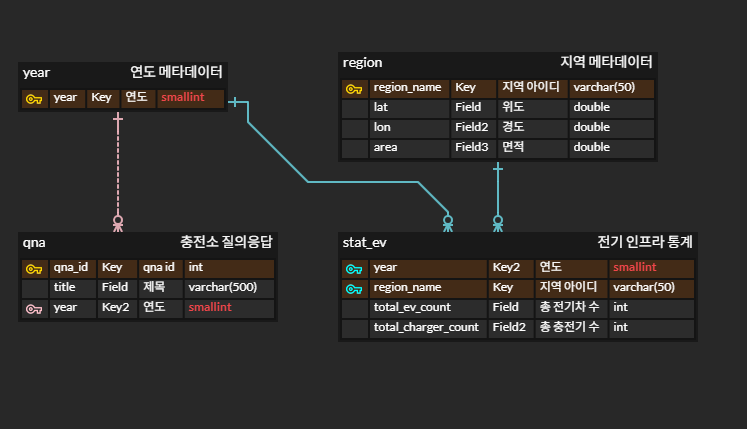

# 기술 명세서 (Technical Specification)

> **전기차 충전 인프라 대시보드 (SKN30-1st-4Team)**
> 본 문서는 프로젝트의 기술적 설계와 구현 세부사항을 기록합니다.

---

## 1. 시스템 아키텍처

### 전체 데이터 흐름

| 단계 | 내용 |
|:---:|:---|
| **① 수집** | 공공데이터 CSV 다운로드 · 메타데이터(인구, 면적, 위경도) 하드코딩 수집 |
| **② 전처리** | `domain/` — Pandas 기반 정제, Wide-to-Long 변환 (평탄화) |
| **③ 프로세싱** | `ev_service.py` & `load_by_csv.py` — 불편 지수(TCII) 산출 및 스키마 검증 |
| **④ 서비스** | Streamlit 대시보드 (`main.py` 및 `web/` 단위 컴포넌트) |

### 데이터 로딩 전략

`domain/load_by_csv.py` 내 `load_ev()` 함수가 핵심적인 역할을 수행하며 DataFrame을 평탄화(Flat)하여 반환합니다.
- CSV를 읽어 병합(Outer Join)
- 2020년 이후 필터링
- 메타데이터(인구, 면적, 공간 정보) 매핑
- 고유 `discomfort_index` (TCII 공식 활용) 산출 후 2차원(Flat) 테이블 형태로 렌더링 컴포넌트에 공급.

---

## 2. 기술 스택

| Python | Pandas | Plotly | Streamlit | Folium |
|:------:|:------:|:------:|:---------:|:------:|
|  |  |  |  |  |

### 상세 의존성

| 분류 | 라이브러리 | 용도 |
|:---|:---|:---|
| 웹 프레임워크 | streamlit | 대시보드 UI 레이아웃 |
| 데이터 처리 | pandas | 데이터프레임 구조화 및 변환 (Melt, Merge) |
| 시각화 (차트) | plotly | 동적 Line/Bar 차트 생성 |
| 시각화 (지도) | folium, streamlit-folium | 핫스팟 히트맵 렌더링 |
| 데이터 검증 | pandera | EVSchema 기반 입출력 데이터 타입 보장 |
| 의존성 관리 | uv | 초고속 파이썬 패키지 제어 |

---

## 3. 데이터베이스 설계

### ERD



*(현재는 MVP 단계로 CSV 모듈이 메인 파이프라인으로 동작 중이며, 향후 DB 연동 확장을 위해 ERD 구조와 연계 파이프라인을 설계했습니다.)*

---

## 4. 모듈별 상세 설명

### Root

| 파일 | 역할 |
|:---|:---|
| `main.py` | Streamlit 진입점. 탭 생성 및 하위 모듈 라우팅 |

### domain/

| 파일 | 역할 |
|:---|:---|
| `ev_service.py` | 서비스 비즈니스 로직 및 전체 데이터 파이프라인 처리 |
| `ev_schema.py` | Pandera 스키마 정의 (`EVSchema`) 및 컬럼명 상수화 |
| `load_by_csv.py` | CSV 로드, 병합, TCII 불편 지수 산출, Meta Mapper |
| `load_by_db.py` | 추후 DB 확장을 고려한 파이프라인 모듈 스텁 |
| `crawling/` | 추가 정보 수집을 위한 웹 브라우저 크롤링 스크립트 |

### web/

| 파일 | 역할 |
|:---|:---|
| `view.py` | UI 메인 탭 컴포넌트 조합 (`show_data_by_year`, `show_data_by_area`) |
| `section_map.py` | Folium 활용 핫스팟 지도 렌더링 및 팝업 정보 |
| `section_comparison_chart.py` | Plotly 기반 수요-공급 비교 Bar Chart 구성 |
| `section_line_chart.py` | 연도/지역별 트렌드 현황 Line Chart 구성 |
| `section_data_table.py` | 상세 데이터 그리드 출력 및 CSV 다운로드 |
| `section_wordcloud.py` | 연도별/키워드 워드 클라우드 이미지 출력 |
| `section_insights.py` | 각종 분석 결과에 대한 텍스트 인사이트 요약 노출 |

---

## 6. 데이터 전처리 파이프라인

```
domain/src_clean/*.csv (전기차 통계, 충전기 통계 등)
    ↓ load_by_csv.py 내 `process_csv()`
    ├─ Wide to Long 포맷 변환 (melt)
    └─ region_name, year 기준 Outer Join 병합
              ↓
         불편 지수(TCII) 산출 및 반환 (Flat DataFrame)
```

**TCII (Total Charger Inconvenience Index) 산출 흐름:**
- 가중치를 반영하여 기기 경쟁 지수, 공간적 거리 지수를 더해 최종 충전 인프라 불편 지수를 계산합니다. 이를 통해 각 지역의 인프라 체감 불편함을 수치화합니다.

---

## 7. 데이터 출처

| 데이터명 | 출처 | 수집 방법 | 비고 |
| :--- | :--- | :--- | :--- |
| **시도별 자동차 등록 현황** | 공공데이터포털 / 국토부 통계누리 | CSV 다운로드 후 전처리 | 전기차(EV) 분포 필터링 |
| **전기차 충전소/충전기 설치 현황** | 공공데이터포털 / 환경공단 | OpenAPI 및 CSV 수집 | 기초 수요/공급 분석 기반 |
| **대한민국 시도 경계 정보** | GIS Developer / 지자체 | 메타데이터 (Lat, Lon, Area) | 공간/거리 지수 산정 활용 |

### 상세 공공데이터 API / CSV 내역

| 데이터 파일 / 서비스 명 | 출처 | 활용처 |
| :--- | :--- | :--- |
| **한국전력공사_지역별 전기차 현황정보** | 공공데이터포털 | 지역별 총 누적 EV 수요 |
| **한국전력공사_지역별 전기차 충전기 현황정보** | 공공데이터포털 | 지역별 총 충전 인프라 공급수 |
| **한국전력공사_지역별 전기차 충전소 현황정보** | 공공데이터포털 | 인프라 단위 공간 분석용 참고 |
| **한국전력공사_충전소의 위치 및 현황 정보** | 공공데이터포털 | 핫스팟 매핑 좌표 참고데이터 |
| **한국환경공단_전기자동차 충전소 정보** | 공공데이터포털 | Open API 및 데이터 보완용 |

---

## 8. 환경 설정 및 실행 가이드

### 사전 요구사항

- **Python**: 3.10 이상
- **의존성 관리**: `uv` 패키지 관리자

### 설치 및 런칭 가이드

```bash
# 1. 패키지 의존성 설치 및 동기화 (경량)
uv sync

# 2. 대시보드 웹 서버 실행
uv run streamlit run main.py
```